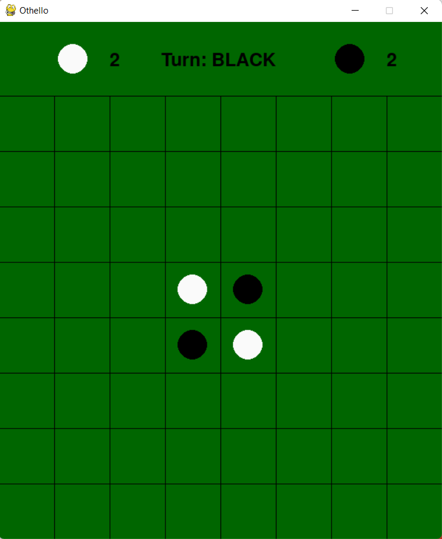
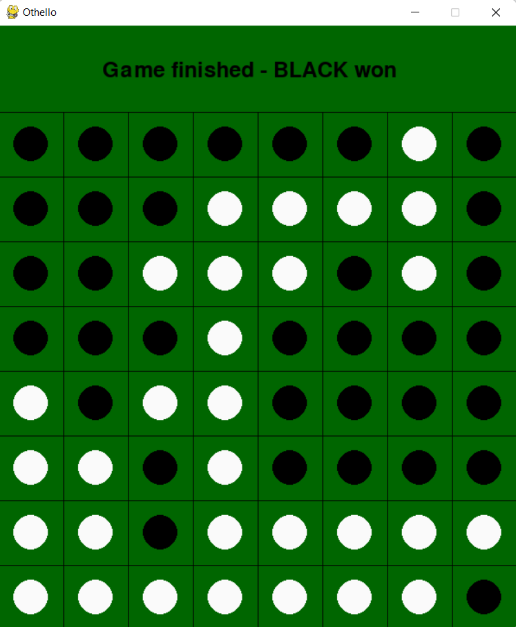

# Othello

Implementing Othello Game (Also known as Reversi) with Python using the Minimax algorithm (Alpha-Beta pruning). 
In the game I developed, Human can play against Human, Human(You) can play against Random Player, Human(You) against AI.

To learn more about the game of Othello please refer to the following wikipedia article: 
https://en.wikipedia.org/wiki/Reversi

## Start the game:
python othello.py

## Game Instructions:

- press 'g' to change gamemode (ai OR pvp)
- press '0' to change ai level to 0 (random ai)
- press '1' to change ai level to 1 (minimax algorithm)
- press 'r' to restart the game

## Game Snapshots:
### Snapshot 1 - Start screen:

### Snapshot 2 - Winning screen:

